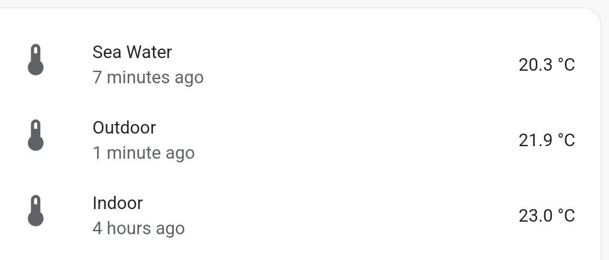
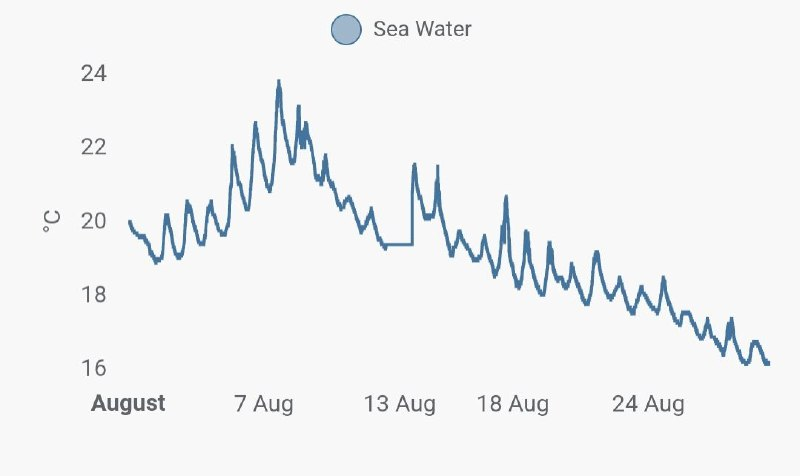
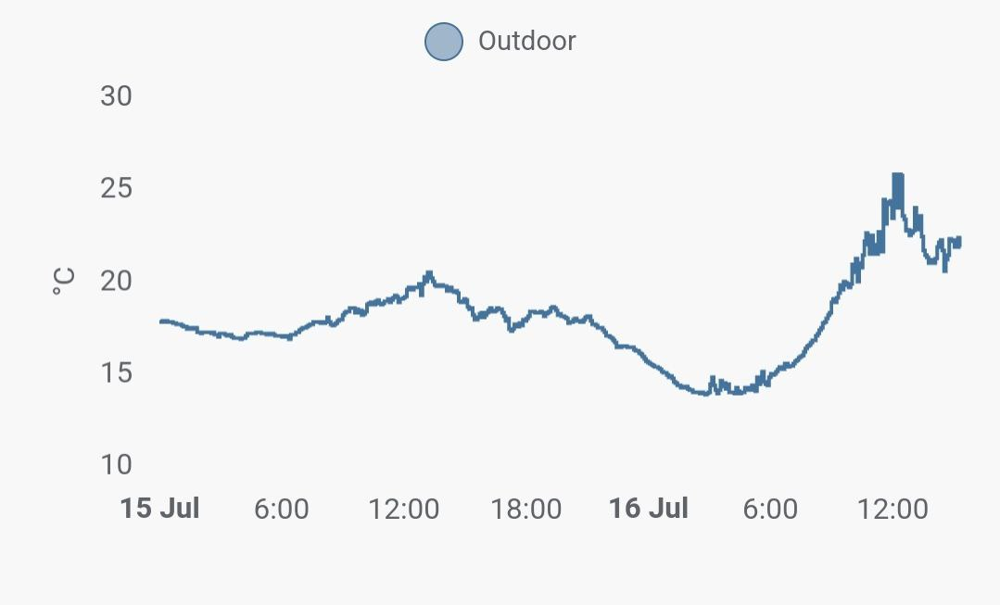

# Temperature Monitoring
Python project with multiple DS18B20 sensors. Config and reporting over MQTT to Home Assistant

<p align="center">
  
</p>

## Quick configuration
One-wire configuration needs to be enabledcd, run and enable in settings
```
sudo raspi-config
```

To enable readings run following commands and reboot.
```
sudo modprobe w1-gpio
sudo modprobe w1-therm
```

Connect wires and read temperature

```
cd /sys/bus/w1/devices
```

There should be a folder 28-xxxxxxxxxxxx

With following command the measurements are shown
```
cat w1_slave
```

## Hardware setup
Example of physical connection can be found here, also in depth configuration steps
* https://www.hackster.io/vinayyn/multiple-ds18b20-temp-sensors-interfacing-with-raspberry-pi-d8a6b0

* http://www.d3noob.org/2015/02/raspberry-pi-multiple-temperature.html


## Result
<p align="center">
  
</p>

<p align="center">
  
</p>
